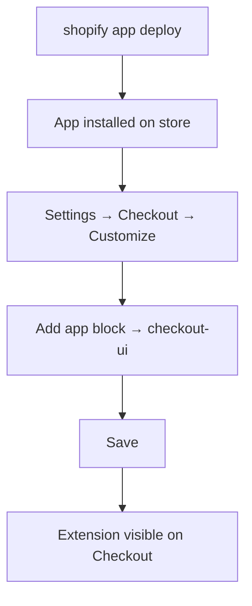
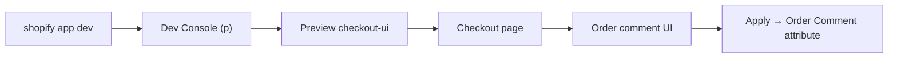

# Checkout UI Extension

A checkout UI extension that lets buyers add an **order comment** and save it as a checkout attribute (`Order Comment`) before completing purchase.

## Overview

| Item | Detail |
|------|--------|
| Entry point | [`src/Checkout.jsx`](src/Checkout.jsx) |
| UI | Polaris web components (`s-form`, `s-text-area`, `s-button`, etc.) |
| Runtime | Preact (`@shopify/ui-extensions/preact`) |
| API version | `2026-04` (see [`shopify.extension.toml`](shopify.extension.toml)) |
| Behavior | Textarea + **Apply**; writes attribute via `useApplyAttributeChange` |
| Validation | Max 200 characters; Apply disabled when empty or invalid |

## Prerequisites

- [Shopify CLI](https://shopify.dev/docs/apps/tools/cli/getting-started)
- Node.js per the app root [`package.json`](../../package.json) (`>=20.19 <22 || >=22.12`)
- A [development store](https://shopify.dev/docs/apps/tools/development-stores) with **checkout extensibility** (enabled by default on new dev stores; older stores may need the [developer preview](https://shopify.dev/docs/api/release-notes/developer-previews#previewing-new-features))
- Products in the store (needed to open checkout)
- This app (`dev-custom-app`) installed on the dev store

> **Note:** Custom in-checkout UI on **production** stores requires [Shopify Plus](https://www.shopify.com/plus).

## Extension layout

| File | Role |
|------|------|
| [`shopify.extension.toml`](shopify.extension.toml) | Extension name, target, capabilities, `api_version` |
| [`src/Checkout.jsx`](src/Checkout.jsx) | UI and attribute logic |
| [`locales/*.json`](locales/) | i18n scaffold (UI strings are currently hardcoded in `Checkout.jsx`) |
| [`package.json`](package.json) | Extension workspace dependencies |

## Configuration

Relevant settings from `shopify.extension.toml`:

| Setting | Value |
|---------|--------|
| **handle** | `checkout-ui` |
| **target** | `purchase.checkout.reductions.render-after` |
| **module** | `./src/Checkout.jsx` |
| **capabilities** | `api_access = true` |

The extension renders in a **fixed position** immediately after the discounts / promo code section.

To change placement or capabilities, edit `shopify.extension.toml` and see the [configuration docs](https://shopify.dev/docs/api/checkout-ui-extensions/latest/configuration).

## Enable on the store

Checkout UI extensions do **not** appear on the live checkout page until a merchant adds the app in the **checkout editor** (this is not the Online Store theme editor).

### Before you start

- `dev-custom-app` is **installed** on the store
- You have run `shopify app deploy` (or use [dev preview](#testing-in-dev-preview) while developing)
- The store supports [checkout extensibility](#prerequisites)

### Steps

1. In Shopify admin, go to **Settings** → **Checkout** → **Customize checkout**.
2. Use the page dropdown at the top to open the checkout area where discounts appear (for example, **Order summary**).
3. Click **Add app block** (bottom left).
4. Select **`checkout-ui`** from the list.
   - If it is missing, confirm the app is installed and `shopify app dev` or `shopify app deploy` has been run recently.
5. Click **Save**.

After saving, the **Order comment** UI is visible on the store’s checkout (not only in the Dev Console preview). With target `purchase.checkout.reductions.render-after`, it renders in the order summary **after the discounts / promo code section**.



## Local setup

From the app root (`dev-custom-app`):

```shell
npm install
npm run setup
shopify app dev
```

- `npm run setup` runs Prisma migrations (required for app sessions during `shopify app dev`).
- On first run, select your Partners organization and dev store, then install the app.
- The CLI starts a tunnel, builds extensions in the workspace, and hot-reloads when you edit `src/Checkout.jsx`.

Verify the linked app and store:

```shell
shopify app info
```

Equivalent dev command from the app root:

```shell
npm run dev
```

## Testing in dev preview



### Primary flow

1. Start dev: `shopify app dev` (or `npm run dev`) from the app root.
2. Press **`p`** to open the **Dev Console**.
3. Under extensions, click **Preview** for `checkout-ui`.
4. On the checkout page, find the UI near the discounts / promo code area.
5. Run through the checklist below.

### Verification checklist

- [ ] Empty comment → **Apply** is disabled.
- [ ] More than 200 characters → validation error shown; **Apply** disabled.
- [ ] Valid comment + **Apply** → no error; attribute is set on checkout.
- [ ] Complete a test order → in Shopify admin, confirm the order has attribute **Order Comment** with the submitted text.

### Manual preview (no Dev Console link)

1. Add products to the cart on your dev store storefront.
2. Go to **Checkout**.
3. With `shopify app dev` running, append `?dev=` to the checkout URL (the CLI adds `tunnel_url`) and reload.

### Property token error

If you see `ShopifyCLI:AdminAPI requires the property token to be set`:

```shell
shopify app dev --checkout-cart-url cart/{variant_id}:{quantity}
```

Replace `{variant_id}` and `{quantity}` with values from your store.

## Testing after deploy

Deploy a new app version that includes this extension:

```shell
shopify app deploy
```

The extension is included in the app version on stores that have the app installed. Merchants must still [enable it in the checkout editor](#enable-on-the-store) before it appears on checkout.

If you change the target to `purchase.checkout.block.render`, merchants can drag the app block to different placements in the editor.

## Troubleshooting

| Symptom | What to check |
|---------|----------------|
| No preview URL in CLI | Run `shopify app info`; ensure products exist and you selected the correct dev store |
| Extension not visible on live checkout | [Enable on the store](#enable-on-the-store): **Add app block** → `checkout-ui` → **Save**; app installed; deploy completed |
| Extension not visible in dev preview | App installed on the store; `shopify app dev` running; try `?dev=` on checkout URL |
| UI errors | Browser DevTools on the checkout page |
| Apply appears to do nothing | Console/network tab; ensure checkout was completed to inspect the order attribute in admin |

## Useful links

- [Checkout UI extensions](https://shopify.dev/docs/api/checkout-ui-extensions)
- [Extension targets](https://shopify.dev/docs/api/checkout-ui-extensions/latest/extension-targets-overview)
- [Configuration](https://shopify.dev/docs/api/checkout-ui-extensions/latest/configuration)
- [Attributes API](https://shopify.dev/docs/api/checkout-ui-extensions/latest/apis/attributes)
- [Shopify CLI — `app dev`](https://shopify.dev/docs/api/shopify-cli/app/app-dev)
- [Test checkout UI extensions](https://shopify.dev/docs/apps/build/checkout/test-checkout-ui-extensions)
- [Deploy app versions](https://shopify.dev/docs/apps/launch/deployment/deploy-app-versions)
